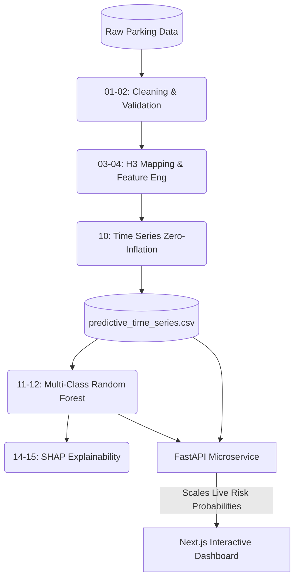

# GridLock AI: Spatio-Temporal Enforcement Priority Intelligence

An end-to-end Machine Learning intelligence system that transforms noisy, historical parking violation data into a predictive enforcement strategy. By leveraging H3 spatial mapping, Random Forest classification, and SHAP explainability, this system predicts future gridlock hotspots and provides traffic commanders with actionable, human-readable insights.


---

## 🔬 The Intelligence Pipeline



This project is built on a massive, sequential data pipeline that cleans, engineers, models, and serves predictive insights.

### Phase 1: Data Cleaning & Inspection (`scripts/01` - `02`)
The raw dataset contains hundreds of thousands of granular GPS coordinates with heavy noise and data leakage (e.g., timestamps of when the data was synced rather than when the violation occurred). We drop these leakage columns, handle null values, and validate spatial boundaries so the model strictly evaluates real-time violation occurrences.

### Phase 2: Feature Engineering & Geospatial Mapping (`scripts/03` - `04`)
Raw, continuous GPS coordinates are computationally expensive to aggregate. We utilize **Uber's H3 Hexagonal Grid (Resolution 8)** to map every coordinate to a discrete geographic block (~460m width). We also engineer temporal features (Hour, Day of Week, Weekend Flags) and multi-hot encode JSON violation arrays (separating "Wrong Parking" from "Obstructing Driver").

### Phase 3: Time Series Aggregation & Classification Modeling (`scripts/10` - `12`)
We collapse the chronological data into highly optimized **Zone-Time Profiles** and inject **Zero-Inflation Padding** to teach the AI what "normal" un-congested hours look like. 
*   **Momentum Features**: We calculate 3-day and 7-day rolling averages to track the escalation of traffic violations over time.
*   **The Model**: We train a Multi-Class `RandomForestClassifier` to predict three distinct Risk Tiers: `Low`, `Medium`, and `High`.

### Phase 4: Explainable AI & Evaluation (`scripts/14` - `15`)
The system doesn't just output a probability. We feed the Random Forest into a **SHAP TreeExplainer** to mathematically extract feature contributions, translating complex mathematical patterns into plain-English alerts (e.g., *"Recent surge in dangerous parking (3-Day Trend)"*).

---

## 🏗️ Web Service Architecture

The final intelligence is deployed through a robust **Client-Server Architecture**:

1.  **AI Microservice (`backend/`)**: A high-performance **FastAPI** server holding the pre-trained `RandomForestClassifier` in memory. It accepts time-travel requests and instantly computes base probabilities, dynamically scaling them via the Commander's UI priorities.
2.  **Command Dashboard (`frontend/`)**: A sleek **Next.js 14** web application built with **Tailwind CSS v4**, **Shadcn UI**, and **Framer Motion**. It uses `react-leaflet` to render highly interactive, beautifully animated geo-spatial intelligence directly over the city grid.

---

## ✨ Key Features

*   **Predictive Time Travel**: Slide forward in time to map exactly where future bottlenecks will occur based on momentum and cyclical patterns.
*   **Commander Control Panel**: Dynamically adjust the priority of specific violations (e.g., crank "Double Parking" to max priority) to instantly re-calculate AI probabilities without needing to re-train the model.
*   **Historical Profiler**: The system extracts the most frequent localized history for every zone to warn officers (e.g., *"Historically accounts for 83% of incidents here"*).
*   **Human-Readable AI (SHAP)**: Translates raw mathematical outputs into plain-English alerts within custom interactive popups.

---

## 🚀 Quickstart Guide

This repository does not track the massive 2.6M row dataset via GitHub. Before starting the servers, you must download the pre-processed predictive dataset.

### Prerequisites
*   **Node.js 18+**
*   **Python 3.9+**

### Step 1: Download the Intelligence Dataset
1. Download the `predictive_time_series.csv` file from Google Drive: **[🔗 Download Dataset Here](https://drive.google.com/drive/folders/1V5M_SK2jJl4_qQGg9ZI2CsXJdIhOrDas?usp=sharing)**
2. Place the downloaded file precisely at: `features/predictive_time_series.csv`

### Step 2: Start the AI Engine (FastAPI Backend)

Open a terminal in the root directory.

```bash
# Create a virtual environment (optional but recommended)
python -m venv .venv
.\.venv\Scripts\activate  # Windows
# source .venv/bin/activate # Mac/Linux

# Install dependencies
pip install -r requirements.txt

# Start the Microservice
uvicorn backend.main:app --port 8000
```
*(Wait until you see `Application startup complete`)*

### Step 3: Start the Web Dashboard (Next.js Frontend)

Open a **second** terminal window and navigate into the `frontend` directory.

```bash
cd frontend

# Install Node modules
npm install

# Start the development server
npm run dev
```

### Step 4: View the Intelligence
Open your browser and navigate to **[http://localhost:3000](http://localhost:3000)**. 

*(Note: The map handles hundreds of highly dense H3 polygon coordinates, so give it a second to smoothly animate onto your screen!)*

---

## 🧠 Pipeline Execution Guide (Optional)

If you want to run the full Data Science pipeline from scratch, ensure your raw data is placed in `data/` and execute the scripts sequentially from the `scripts/` directory:

```bash
cd scripts

# 1. Cleaning & Feature Engineering
python 01_dataset_inspection.py
python 02_data_cleaning.py
python 03_feature_engineering.py
python 04_aggregation.py

# 2. Advanced Time Series Generation (Zero-Inflation)
python 10_time_series_aggregation.py

# 3. Model Training & Evaluation
python 11_risk_classification_model.py
python 12_severity_learning.py
python 14_explain_predictions.py
python 15_evaluate_models.py
```
