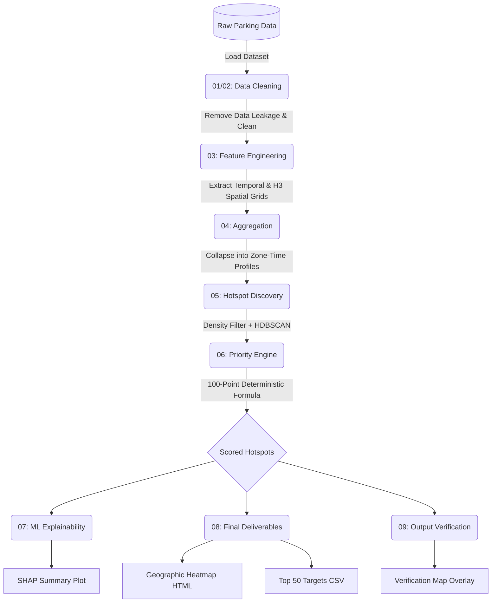

# AI-Driven Parking Intelligence System 🚔

An end-to-end intelligence system that transforms noisy, historical parking violation data into an actionable enforcement deployment strategy. By leveraging H3 spatial mapping, HDBSCAN clustering, and a deterministic priority engine, this system directs traffic commanders precisely to the highest-impact locations.

---

## 🏗️ Architectural Flow

The pipeline is completely automated and runs in a sequential, 9-stage process. 



### 1. Data Cleaning & Inspection (`01` & `02`)
The raw dataset is highly granular and contains post-event data leakage (timestamps of when the data was synced to the cloud). We drop these leakage columns, handle null values, and validate spatial coordinates so the system only evaluates what happened *at the time* of the violation.

### 2. Feature Engineering & H3 Mapping (`03`)
Raw GPS coordinates are continuous and difficult to aggregate. We utilize **Uber's H3 Hexagonal Grid (Resolution 8)** to map every coordinate to a discrete geographic block (~460m width). We also extract temporal features (Hour, Peak Hour flags) and multi-hot encode JSON violation arrays (e.g., separating "Wrong Parking" from "Obstructing Driver").

### 3. Aggregation (`04`)
We collapse the chronological data into highly optimized **Zone-Time Profiles** (e.g., "Hexagon A at 5:00 AM"). By grouping data across the entire timeline into these static buckets, we can mathematically calculate Weekly Persistence and Repeat Offender Ratios.

### 4. Hotspot Discovery (`05`)
To find macro-level hotspots, we calculate the total violation density for every H3 cell. We apply a **Density Filter** to throw away empty streets, effectively shattering the continuous city grid into distinct, ultra-dense islands. We then run **HDBSCAN** clustering on these islands to label the primary geographical hotspots.

### 5. The Priority Engine (`06`)
The core of the system. Every Zone-Time profile is run through a deterministic scoring algorithm to generate a **Priority Score (0-100)**:
*   `40%`: Volume/Density 
*   `30%`: Weekly Persistence
*   `20%`: Severity Score (weighted heavily towards severe obstructions like Footpath parking or Bus Stop blocking)
*   `10%`: Repeat Offender Ratio

### 6. Explainability & Deliverables (`07`, `08`, `09`)
*   **Explainability**: We train a Random Forest on the granular rules to extract **SHAP** values, mathematically proving *why* the rules engine prioritized specific zones.
*   **Deliverables**: The system outputs an interactive Folium Geographical Heatmap, Temporal Charts, and a CSV of the Top 50 uniquely targeted geographic locations.

---

## 🚀 How to Execute the Pipeline

Because this repository does not track large datasets or generated outputs (as per `.gitignore`), you will need to set up the data folders first.

### Prerequisites
1. Ensure Python 3.9+ is installed.
2. Install the required dependencies:
```bash
pip install -r requirements.txt
```

### Setup Directory Structure
Create the following empty directories in the root folder before running the pipeline:
```bash
mkdir data cleaned features models outputs reports
```

### Add the Raw Data
Place your raw parking ticket dataset inside the `data/` folder. The system expects it to be named `cleaned_data.csv` or similar (ensure the input path in `01_dataset_inspection.py` matches your file).

### Run the Pipeline
Execute the scripts sequentially from your terminal:

```bash
# 1. Clean data and engineer features
python 01_dataset_inspection.py
python 02_data_cleaning.py
python 03_feature_engineering.py

# 2. Aggregate into Zone-Time blocks
python 04_aggregation.py

# 3. Discover Hotspots & Score them
python 05_hotspot_discovery.py
python 06_priority_engine.py

# 4. Generate Explainability and Dashboards
python 07_modeling_explainability.py
python 08_deliverables.py
python 09_verification.py
```

### View Results
Once execution is complete, open your `outputs/` directory. Double-click `hotspot_heatmap.html` or `verification_map.html` to view the interactive intelligence maps in your browser!
